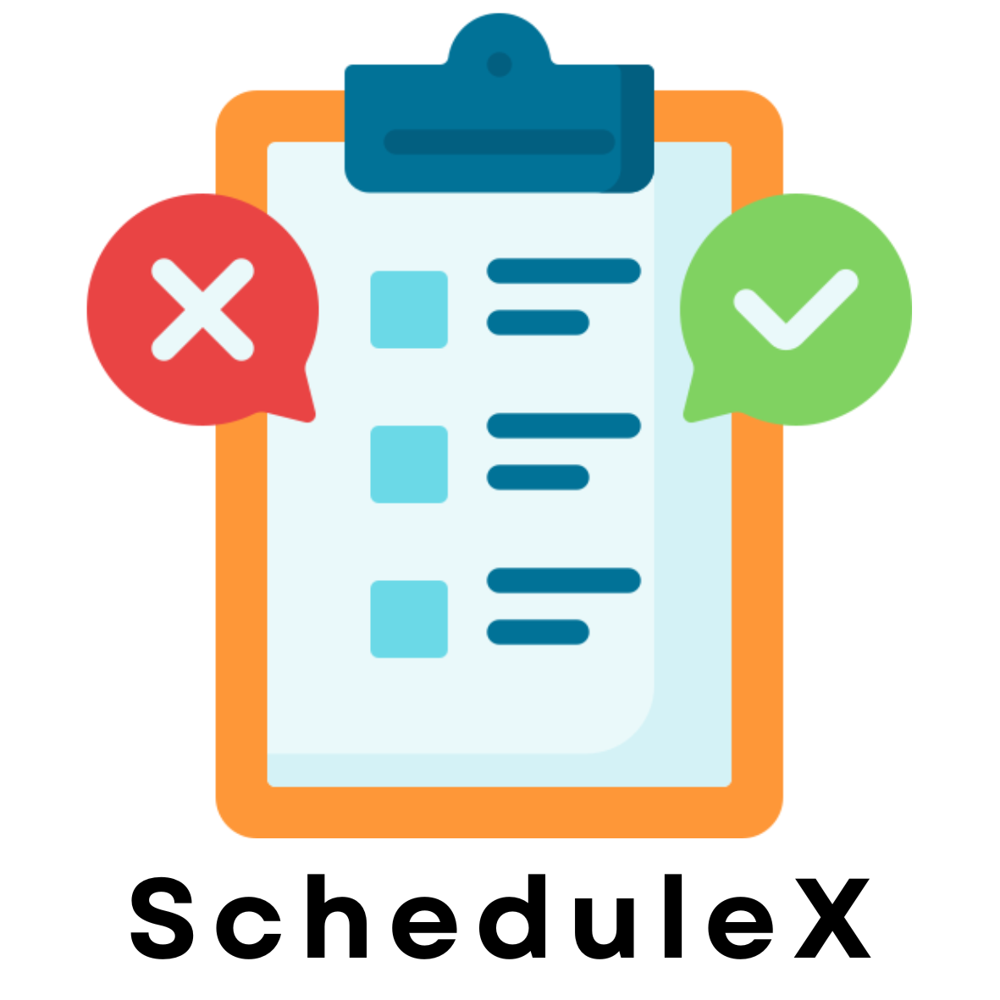

# ScheduleX - Schedule It, Complete It

A simple Scheduler app for task management and productivity.

## Local Environment Setup

To run the following project on your local systems follow the following steps :

### Flutter Setup
- Follow the given documentation link for Flutter environment setup: [Flutter Installation Guide](https://docs.flutter.dev/get-started/install)
- Flutter SDK has to be installed from the following link: [Flutter Install](https://docs.flutter.dev/get-started/install)

### Android Studio Installation
- Download and Install the latest version of Android Studio to use the Emulator, through the following link: [Android Studio](https://developer.android.com/studio/install)
- Once the Android Studio is downloaded, configure command-line tools with the following steps:
    - Launch Android Studio
    - Access "More Actions" on the boot window, and select SDK Manager.
    - In the "Android SDK" section, navigate to SDK Tools.
    - Enable "Android SDK Command-line Tools (latest)" and click OK.
 
***Open a Terminal and run the `flutter doctor` to check if all the installations are done properly.***

Running `flutter doctor` may prompt you to accept some Android licenses. Use the following command to resolve this:

`flutter doctor --android-licenses`

### Cloning the Repository
- To clone the repository make sure that your terminal has git installed...
- Next type: `git clone https://github.com/McLucifer2646/ScheduleX.git` to clone the repository as a folder in your local space.

### Launching the Application
- The recommended way to run the application would be by downloading the APK of the app provided [here](https://drive.google.com/drive/folders/1kpMN9JDqtvC1VN54F_wqDhSK7JGCp4Dm?usp=sharing)

- Another method would be to clone the repository and install the dependencies using the steps given below:
- Navigate to the folder and run: `flutter clean`
- To install dependencies run: `flutter pub get`
- Now to build the app, open an emulator or connect your Android device and run: `flutter run`.

The app will now automatically open on your device and you can use your Google or Facebook credentials to log in directly
or sign up as a new user by clicking on the `Register Now` button on the login Screen.

The App Icon will look like this on your Home Screen and will be labeled _**ScheduleX**_

  

  
  

 
  
 
  
